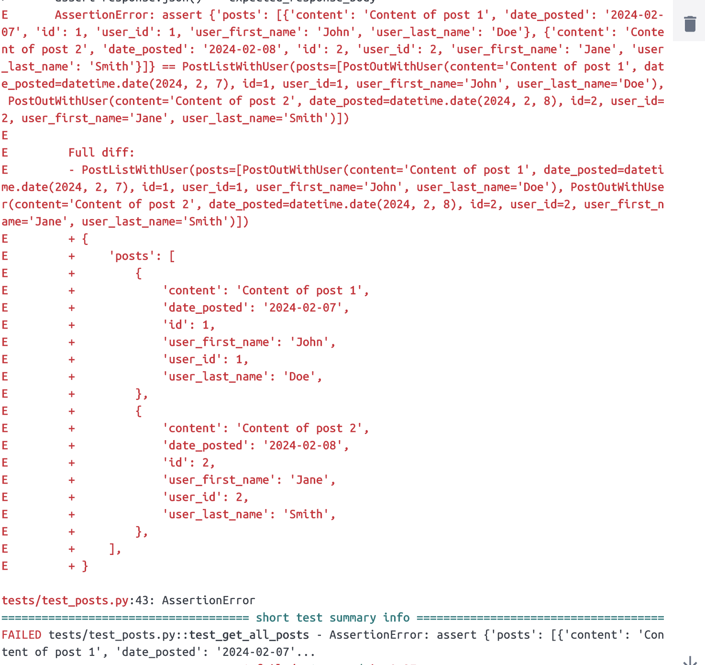

# Sherika Fayson's Journal

## 14

2/8/2024
I spent the morning working on fixing the unit test. With some help from Dalonte I learned that the test was failing because the date was being injected into the test twice in two different formats. So I instead accessed the posts to assert the user's first name was john. When that passed I checked other attributes of the posts to ensure the test would still pass. In doing this all conditions that I tested passed. Now I am running into the issue where the unit test is failing pipeline tests due to a signing key error. I just realized that they that I was return the response was causing the date is added to the post as the test is run so but including the date into my mock data unintentionally cause the result to include the date twice in two different formats by changing the assert response I was able to get the test to pass with no errors

## 13

2/7/2024
Working on unit tests for get all posts. I was able to get the unit tests to work but it failed due to the date. I enlisted the help of a seir but we were unable to see why the date was causing the test to fail. I will revisit this tomorrow.

## 12

2/6/2024
Today my main focus was to find the source of the red nav bar. I found that the navbar had a class of bg-danger. This caused the red background color once removed I was able to apply styling to the navbar. Once everyone is at a good stopping point we are going to make a decision about the color scheme and any further styling.

## 11

2/5/2024
Started on the css for the project. I was unsure of the styling theme of the project. Some inspiration was borrowed from facebook and linkedin. Navbar is red and currently unsure how to remove the color.

## 10

2/2/2024
After much thought and tinkering like Tinker Bell, I was able to get the Home page to have have the user's name to be a clickable link that takes the user to their profile. To accomplish this I had to update the posts models to include the user_id, the user_first_name, and the user_last_name. From there I updated the post query for create post function and the list my post functions. After that I update the route for get posts to get(/post/user_id). The reason this is necessary is because the user_id is a foreign key for the users table and allows us to obtain data from the user relationship to associate with the posts table. Now I am able to list posts by the users name, the time/date, and content so that the posts can be identified by who created the post.

## 9

2/1/2024
I made the user's name clickable. When the user clicks on a users profile card they are taken the that particular user's profile that lists all of their posts. When attempting to add the same functionality to the home page. I found that it would require the posts models and queries to be rewritten because how they are written currently they only associate the username to the posts. This cause an issue when trying to route to a page that requires the userid to get the user info.

## 8

1/31/2024
Updated Homepage so that when the submit button is click it will redirect the user to the signup page. At first I was attempting to use useHistory but learned that it was deprecated. I used this article: https://medium.com/@bobjunior542/using-usenavigate-in-react-router-6-a-complete-guide-46f51403f430 to help walk me through how to implement its use.

## 7

1/30/2024
With user profile at a good stopping place. I started on the homepage after sign up. My current blocker is that the way the model is currently written there is not way to access the username to display who wrote the posts. The only thing that displays is the posts and the time/date that they were posted.

## 6

1/29/2024
I learned that the username was not being passed in the api call because the model was not set up to pass the user_id. It was written to only pass the post id and the content. Once the model was updated to include the user_id. The username was able to be displayed with user posts. also added some light css.

## 5

1/26/2024
Was unable to get user_id undefined error corrected, but noticed that when I attempted to list the username of the person's posts no username was found.

## 4

1/25/2024
Worked on user profile page. was unable to lists user posts due to user_id not defined error. I had to hard code username in api endpoint to be able to see user info being pull from database.

## 3

1/23/2024
When creating the get mine endpoint found that information needed for that endpoint was the same as an existing query. So I linked get_user_posts to get the get mine endpoint instead of writing a duplicate query.

## 2

1/18/2024
created delete user endpoints

## 1

1/17/2024
Created issue tickets for api endpoints
